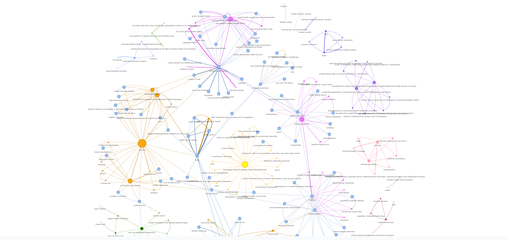
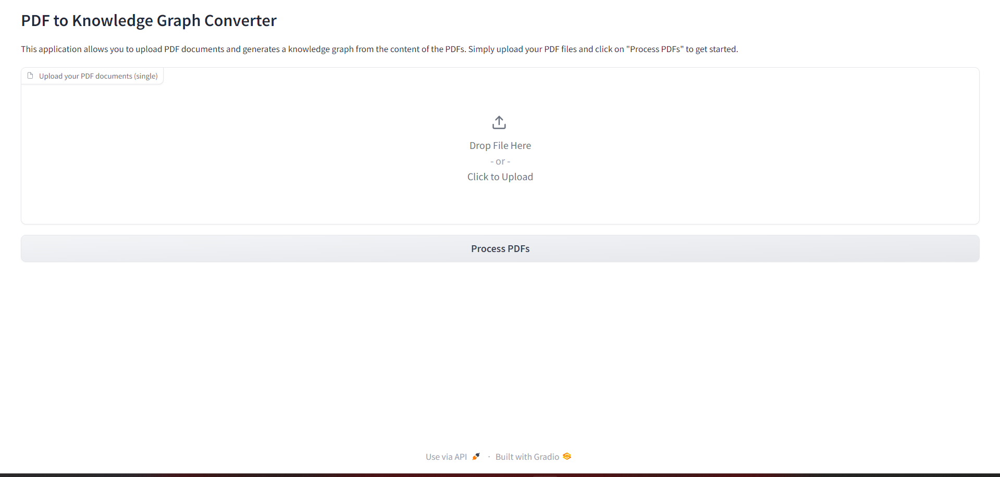

# Convert any Corpus of Text into a *Knowledge Graph*

## What is a knowledge graph?
A knowledge graph, also known as a semantic network, represents a network of real-world entities—i.e. objects, events, situations, or concepts—and illustrates the relationship between them. This information is usually stored in a graph database and visualized as a graph structure, prompting the term knowledge "graph."

## How to create a simple knowledge graph from a body of work?
1. Clean the text corpus (The body of work).
2. Extract concepts and entities from the body of work.
3. Extract relations between the entities.
4. Convert a graph schema.
5. Populate nodes (concepts) and edges (relations).
6. Visualise and Query.

## Why Graph?
Once the Knowledge Graph (KG) is built, we can use it for many purposes. We can run graph algorithms and calculate centralities of any node, to understand how important a concept (node) is to this body of work. We can calculate communities to bunch the concepts together to better analyse the text. We can understand the connectedness between seemingly disconnected concepts. The best of all, we can achieve **Graph Retrieval Augmented Generation (GRAG)** and chat with our text in a much more profound way using Graph as a retriever. This is a new and improved version of **Retrieval Augmented Generation (RAG)** where we use a vector database as a retriever to chat with our documents.

---

## This project
Here I have created a simple knowledge graph from a PDF document. The process I follow here is very similar to what is outlined in the above sections, with some simplifications.

First, I split the entire text into chunks. Then I extract concepts mentioned within each chunk using an LLM. Note that I am not extracting entities using an NER model here. There is a difference between concepts and entities. For example, 'Bangalore' is an entity, and 'Pleasant weather in Bangalore' is a concept. In my experience, concepts make more meaningful KG than entities.

I assume that the concepts that are mentioned in the vicinity of each other are related. So every edge in the KG is a text chunk in which the two connected concepts are mentioned.

Once the nodes (concepts) and the edges (text chunks) are calculated, it is easy to create a graph out of them using the libraries mentioned here. All the components I used here are set up locally, so this project can be run very easily on a personal machine. I have adopted a no-GPT approach here to keep things economical. I am using the fantastic Mistral 7B openorca instruct, which crushes this use case wonderfully. The model can be set up locally using Ollama so generating the KG is basically free (No calls to GPT).

1. Split the corpus of text into chunks. Assign a chunk_id to each of these chunks.
2. For every text chunk extract concepts and their semantic relationships using an LLM. Let's assign this relation a weightage of W1. There can be multiple relationships between the same pair of concepts. Every such relation is an edge between a pair of concepts.
3. Consider that the concepts that occur in the same text chunk are also related by their contextual proximity. Let's assign this relation a weightage of W2. Note that the same pair of concepts may occur in multiple chunks.
4. Group similar pairs, sum their weights, and concatenate their relationships. So now we have only one edge between any distinct pair of concepts. The edge has a certain weight and a list of relations as its name.

Additional it also calculates the Degree of each node, and Communities of nodes, for sizing and coloring the nodes in the graph respectively.

**[Here is a Medium article explaining the method in detail ](https://medium.com/towards-data-science/how-to-convert-any-text-into-a-graph-of-concepts-110844f22a1a)**

---

## Tech Stack

### Mistral 7B

I am using the [Mistral 7B Openorca](https://huggingface.co/Open-Orca/Mistral-7B-OpenOrca) for extracting concepts out of text chunks. It can follow the system prompt instructions very well.

### Ollama

Ollama makes it easy to host any model locally. Mistral 7B OpenOrca version is already available with Ollama to use out of the box. To set up this project, you must install Ollama on your local machine.

Step 1: Install Ollama https://ollama.ai
Step 2: run `ollama run zephyr` in your terminal. This will pull the zephyr model to your local machine and start the Ollama server.

### Pandas dataframes for graph schema (can use a graphdb at a later stage).

### NetworkX
<a href="https://networkx.org"><a/>

This is a python library that makes dealing with graphs super easy

### Pyvis
[Pyvis python library](https://github.com/WestHealth/pyvis/tree/master) for visualisation. Pyvis generates Javascript Graph visualisations using python, so the final graphs can be hosted on the web.

### FastAPI

FastAPI is a modern, fast (high-performance), web framework for building APIs with Python 3.7+ based on standard Python type hints.

### Gradio

Gradio is a library for creating customizable UI components around machine learning models. In this project, it is used to create a user interface for interacting with the knowledge graph.
